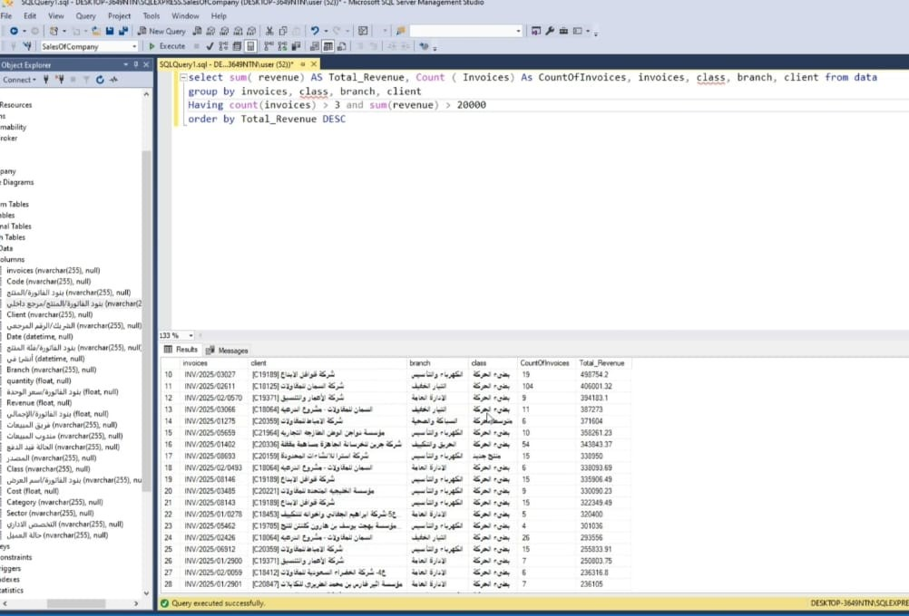
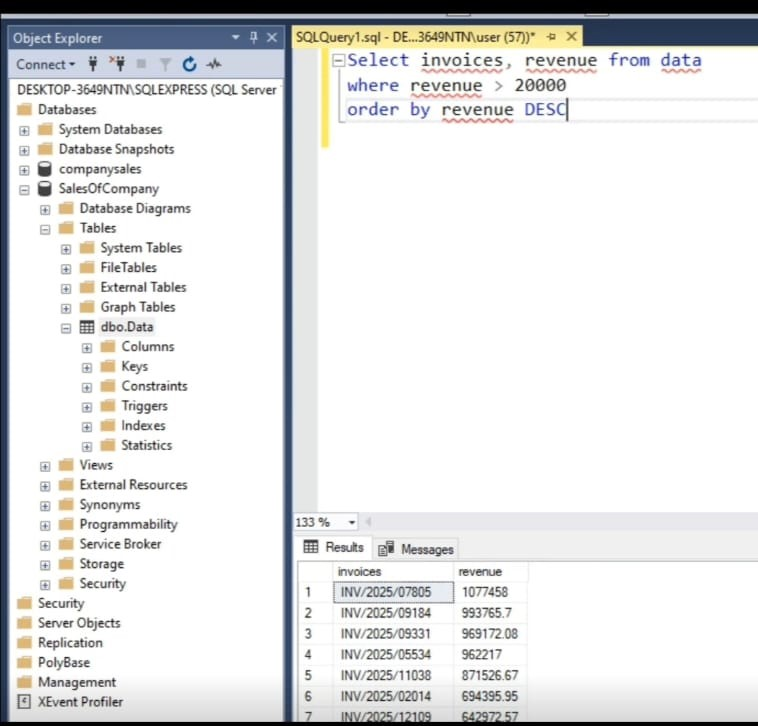

# 📊 SQL: Data Import, Validation & Analysis

## 🎥 Demo Video
[▶️ Watch Demo](SQL.mp4)

## 📌 Overview
This project demonstrates hands-on experience with **SQL**, including importing data through multiple methods, validating data types (dates, numbers, text), and writing queries for filtering, sorting, and aggregation.  

The dashboard and queries showcase how raw data can be organized, cleaned, and transformed into actionable insights.  

## ✨ Key Skills Demonstrated
- Data import and preparation  
- Data type validation and consistency checks  
- Writing analytical queries with filtering, sorting, and aggregation  
- Structuring raw data for meaningful insights  

## 🎯 Goal
To showcase practical SQL skills in data management and analysis, highlighting the ability to turn raw information into insights for decision-making.
